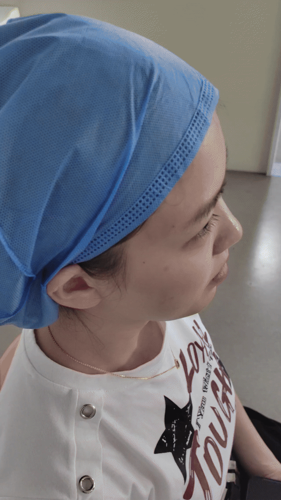
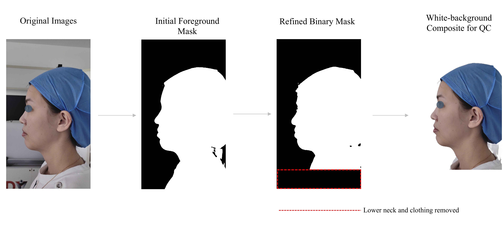
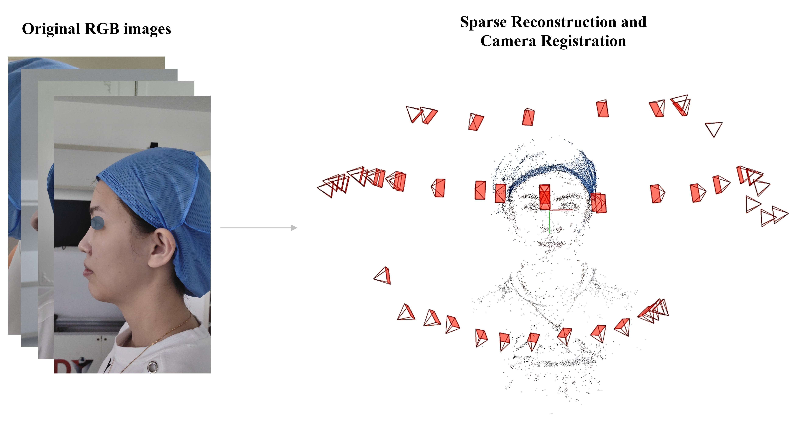
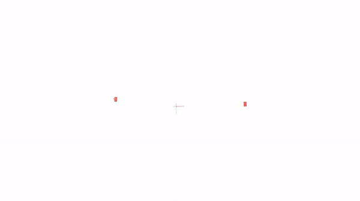

> 🔒 **Data Privacy & Compliance Notice:** This pipeline is engineered for **100% offline edge computing**. All tracking, feature matting, 2DGS training, and physical metric calibration are executed locally on consumer-grade hardware. Zero facial biometrics or sensitive patient data are transmitted to cloud-based services, ensuring full alignment with strict data governance frameworks (e.g., European Union AI Act for high-risk medical AI).
This repository provides the implementation and supplementary materials associated with the manuscript:

**A Locally Deployable Smartphone-Video Pipeline for Scalable 3D Craniofacial Assessment in Low-Resource Clinical Settings**

The workflow includes:

1. Smartphone video acquisition
2. Frame extraction & Foreground masking
3. COLMAP reconstruction
4. 2D Gaussian Splatting
5. Metric calibration
6. Quantitative evaluation

## Environment Setup

### Python Dependencies

This requirements file provides the Python dependencies required by the utility scripts in this repository.

```bash
pip install -r requirements.txt
```

### External Software

The CranioCapture workflow additionally relies on the following external software:

- FFmpeg
- COLMAP
- 2D Gaussian Splatting

### Recommended Environment

- Windows 11 / Ubuntu 22.04 (WSL)
- Python 3.10+
- CUDA 11.8+
- NVIDIA GPU (recommended)


## Phase 1. Smartphone Video Acquisition
The patient is seated in a natural head position while a smartphone is moved along an inverse S-shaped trajectory around the face.

A 5-second demonstration of the smartphone video acquisition procedure.

<table border="0">
<tr>
<td width="75%" align="center">
<b>Workflow</b>
</td>

<td width="25%" align="center">
<b>5-second Demo</b>
</td>
</tr>

<tr>

<td width="75%" align="center" valign="middle">

</td>

<td width="25%" align="center" valign="middle">

</td>

</tr>
</table>


## Phase 2. Frame Extraction & Foreground Masking

Video frames are extracted from the recorded smartphone video. A foreground matting model is subsequently applied to remove background structures and generate patient-specific facial masks.

<p align="center">
  
</p>

**Related Script**

[`Extract_Frames.py`](scripts/Extract_Frames.py)

[`Generate_Headneck_Masks.py`](scripts/Generate_Headneck_Masks.py)


## Phase 3. COLMAP-Based Camera Pose Estimation and Sparse Reconstruction 

COLMAP is used to estimate camera poses and generate a sparse 3D reconstruction from multi-view facial images.

<table border="0">
<tr>

<td width="65%" align="center" valign="middle">

</td>

<td width="35%" align="center" valign="middle">

</td>

</tr>
</table>

<p align="center">
Feature Extraction → Feature Matching → Camera Pose Estimation → Sparse Reconstruction
</p>

## Phase 4. 2D Gaussian Splatting Reconstruction [WSL / Linux]

The masked multi-view images and COLMAP-derived camera parameters are used as input for 2D Gaussian Splatting reconstruction.

This phase is based on the official implementation of [2D Gaussian Splatting for Geometrically Accurate Radiance Fields](https://github.com/hbb1/2d-gaussian-splatting). Please refer to the original repository for installation details, environment configuration, and citation information.

<p align="center">
  
</p>

<p align="center">
Input → COLMAP cameras + masked RGB images
</p>
<p align="center">
Output → 2DGS model, rendered views, and reconstructed mesh
</p>


## Phase 5. Metric Calibration

The reconstructed model is calibrated to a real-world metric scale using a reference object with known dimensions. This step enables quantitative measurements to be reported in millimeters rather than arbitrary reconstruction units.

<p align="center">
  
</p>

**Input → Reconstructed mesh + reference scale**

**Output → Metric-scaled 3D model and quantitative measurements**

**Related Script**

[`Clinical_Measurement_GUI.py`](scripts/Clinical_Measurement_GUI.py)

## Repository Structure

```text
CranioCapture/
├── docs/
│   ├── images/
│   ├── gifs/
│   └── mp4/
├── scripts/
│   ├── Extract_Frames.py
│   ├── Generate_Headneck_Masks.py
│   └── Clinical_Measurement_GUI.py
├── requirements.txt
├── LICENSE
└── README.md

## Notes

This repository currently provides the workflow scripts, visual demonstrations, and documentation for CranioCapture. The associated manuscript is under preparation.
